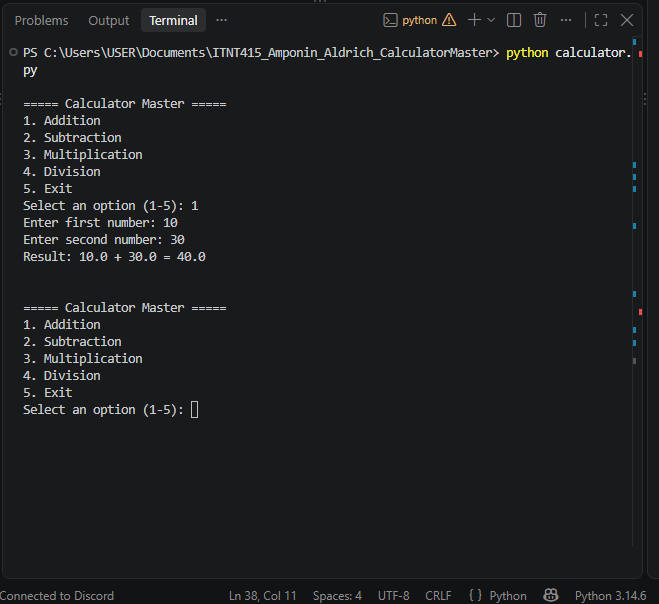

# Calculator Master

Aldrich Amponin
ITNT415 — BIT41

Simple menu-driven calculator made in Python for a Git/GitHub branching assignment. Each operation was built on its own branch and merged into main through a Pull Request.

## Branches
- main – final calculator
- addition_Amponin
- subtraction_Amponin
- multiplication_Amponin
- division_Amponin

## Features
- Add, subtract, multiply, divide
- Keeps running until you choose Exit
- Rejects non-numeric input
- Handles division by zero

## Sample Run
